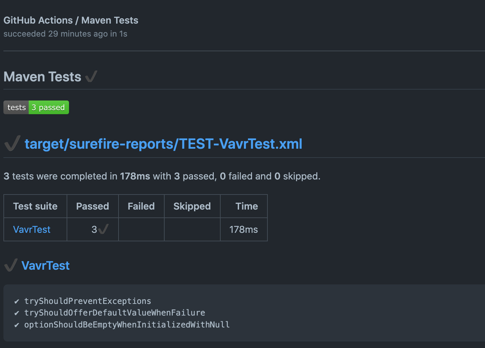

# GameCleanCode4AL

## CI/CD
> La CI/CD est effectuée via les outils Github Actions à travers les différents workflows mis en place.

### Tests

Le workflow [**tests**](.github/workflows/tests.yml) permet de lancer les tests
unitaires de l'application et de générer des rapports.

Cette pipeline est lancée sur les pull requests et les pushs sur
la branche principale et toutes les branches `feature/*` et `fix/*`.

Les tests ont été écrits avec Junit 5.

Tous les tests sont lancés, mais ne sont pas bloquant pour pouvoir récupérer un rapport complet.

Le rapport est généré avec le plugin maven-surefire-plugin.
Il est ensuite affiché dans l'action github grace à l'étape `Report` 
utilisant [dorny/test-reporter@v1](https://github.com/dorny/test-reporter).

Enfin, le code est analysé par SonarCloud qui permet d'obtenir des métriques de qualité de code
et leur évolution.
Le code coverage est lui généré par Jacoco et simplement envoyé à SonarCloud.

### Docker
> L'application est conteneurisée avec Docker, voir [**Dockerfile**](./Dockerfile).

Le workflow [**dockerhub**](.github/workflows/dockerhub.yml) publie l'image docker du projet a chaque nouveau
commit sur la branche principale sur un repository DockerHub. L'image publiée contient alors la version
à jour du projet sous la forme d'un l'executable `jar`.

